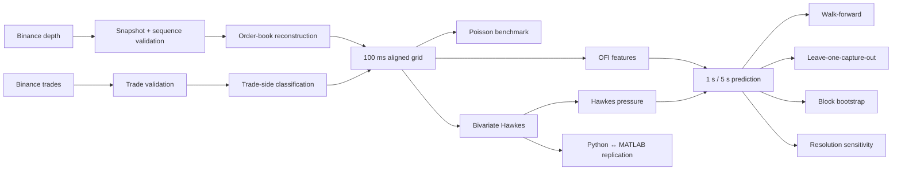

# Hawkes–OFI Market Microstructure

<p align="center">
  <strong>BTCUSDT market microstructure research with Hawkes processes, order-flow imbalance, and strict cross-capture validation.</strong>
</p>

<p align="center">
  <a href="#overview">Overview</a> ·
  <a href="#research-question">Research Question</a> ·
  <a href="#methodology">Methodology</a> ·
  <a href="#results">Results</a> ·
  <a href="#reproducibility">Reproducibility</a> ·
  <a href="#repository-structure">Repository</a>
</p>

<p align="center">
  
  
  
  
  
  
  
</p>

---

## Overview

This project studies whether the **temporal clustering of buy- and sell-side trade arrivals** contains predictive information about short-horizon BTCUSDT mid-price returns beyond a conventional **Order-Flow Imbalance (OFI)** benchmark.

The central signal is derived from a bivariate Hawkes process:

$$
H_t = \lambda_{B,t} - \lambda_{S,t}
$$

where:

- $\lambda_{B,t}$ is the conditional buy-arrival intensity;
- $\lambda_{S,t}$ is the conditional sell-arrival intensity;
- positive $H_t$ indicates relatively stronger conditional buy pressure;
- negative $H_t$ indicates relatively stronger conditional sell pressure.

The project is designed as a reproducible market-microstructure experiment. It combines live market capture, deterministic order-book reconstruction, point-process estimation, out-of-sample validation, bootstrap analysis, temporal-resolution sensitivity, and an independent MATLAB implementation.

---

## Research Question

### Primary question

> Does explicitly modeling the temporal clustering of trades with a Hawkes process provide predictive information about short-horizon BTCUSDT returns beyond a simple L1 OFI benchmark?

### Secondary questions

- Are trade arrivals adequately described by a Poisson process?
- How strong is buy- and sell-side self-excitation?
- Does Hawkes pressure map into future price returns?
- Does the signal generalize to an entirely held-out market capture?
- Does adding OFI materially improve Hawkes pressure?
- How sensitive is the result to temporal resolution?
- Can the core estimator be independently reproduced in MATLAB?

---

## Research Status

| Component | Status |
|---|---|
| Live market capture | ✅ Complete |
| Snapshot/depth synchronization | ✅ Complete |
| Trade validation | ✅ Complete |
| Order-book reconstruction | ✅ Complete |
| L1 / multi-level OFI | ✅ Complete |
| Poisson benchmark | ✅ Complete |
| Bivariate Hawkes estimation | ✅ Complete |
| Walk-forward validation | ✅ Complete |
| Cross-capture validation | ✅ Complete |
| Leave-one-capture-out validation | ✅ Complete |
| Block-bootstrap analysis | ✅ Complete |
| State-conditioned analysis | ✅ Complete |
| Resolution sensitivity | ✅ Complete |
| Python implementation | ✅ Complete |
| MATLAB replication | ✅ Complete |
| Exact-grid Python/MATLAB check | ✅ Complete |
| Publication figures | ✅ Complete |
| Consolidated result tables | ✅ Complete |
| Expanded independent capture study | ⏳ Future work |
| Economic execution / transaction-cost study | ⏳ Future work |

---

## Dataset

The current dataset contains three independently captured BTCUSDT episodes of approximately ten minutes each.

| Capture | Duration | Trades | Buys | Sells | Book states |
|---|---:|---:|---:|---:|---:|
| `capture_02` | ~600 s | 13,117 | 8,182 | 4,935 | 6,000 |
| `capture_03` | ~600 s | 18,595 | 8,925 | 9,670 | 6,002 |
| `capture_04` | ~600 s | 7,730 | 4,845 | 2,885 | 6,000 |
| **Total** | **~1,800 s** | **39,442** | **21,952** | **17,490** | **18,002** |

### Trade composition

| Capture | Trade rate / s | Buy fraction | Sell fraction |
|---|---:|---:|---:|
| `capture_02` | 21.89 | 62.38% | 37.62% |
| `capture_03` | 31.01 | 47.99% | 52.00% |
| `capture_04` | 12.89 | 62.68% | 37.32% |

The captures are deliberately heterogeneous. The primary validation therefore treats each capture as an independent episode rather than randomly splitting adjacent observations.

---

## Research Pipeline



---

# Methodology

## 1. Order-book reconstruction

Each capture begins with an exchange order-book snapshot followed by sequential depth updates.

The reconstruction pipeline validates:

- snapshot integrity;
- depth sequence continuity;
- final update identifiers;
- trade records;
- reception timestamps.

The resulting state series is aligned to a common 100 ms research grid.

---

## 2. Trade-side classification

Trade events are separated into buy- and sell-side arrivals using the exchange trade-stream maker indicator under the convention used throughout the project.

For each capture, trade counts are aggregated into the same 100 ms grid used by the reconstructed book states.

---

## 3. Order-Flow Imbalance

L1 OFI is the primary benchmark.

Additional model-development variants include:

- L10 OFI;
- normalized OFI;
- depth-weighted OFI;
- OFI + Hawkes combinations.

The primary comparison is intentionally simple:

$$
\text{L1 OFI}
\quad\text{vs}\quad
\text{Hawkes pressure}.
$$

---

## 4. Bivariate Hawkes model

The primary point-process model uses same-side exponential self-excitation:

$$
\lambda_B(t)
=
\mu_B
+
\alpha_B
\int_0^t
e^{-\beta(t-s)}
\,dN_B(s)
$$

and

$$
\lambda_S(t)
=
\mu_S
+
\alpha_S
\int_0^t
e^{-\beta(t-s)}
\,dN_S(s).
$$

The branching ratios are

$$
n_B=\frac{\alpha_B}{\beta},
\qquad
n_S=\frac{\alpha_S}{\beta}.
$$

Because the primary specification uses a diagonal excitation matrix, the spectral radius is

$$
\rho=\max(n_B,n_S).
$$

All fitted captures satisfy $\rho<1$.

---

## 5. Hawkes pressure

The research signal is

$$
H_t=\lambda_{B,t}-\lambda_{S,t}.
$$

It converts the two conditional event intensities into one signed pressure statistic.

---

## 6. Binned likelihood

The 100 ms event stream is represented as buy and sell counts per bin.

For the exponential kernel,

$$
d=e^{-\beta\Delta t}.
$$

The expected event count in a bin is represented by the corresponding decayed historical state and the baseline intensity. Parameters are obtained by numerical maximum likelihood subject to the stationarity constraint.

---

## 7. Forecast target

For prediction horizon $h$:

$$
r_{t,t+h}
=
\log P_{t+h}
-
\log P_t.
$$

The main horizons are:

- $h=1$ second;
- $h=5$ seconds.

---

# Validation Design

The strongest validation is **leave-one-capture-out**.

```text
capture_02 + capture_03  →  capture_04
capture_02 + capture_04  →  capture_03
capture_03 + capture_04  →  capture_02
```

The held-out capture is excluded from model fitting.

This is stricter than randomly splitting adjacent observations because high-frequency market data are strongly serially dependent.

---

# Results

## 1. Trade-arrival clustering

For a Poisson process:

$$
\operatorname{Var}(N)=E[N]
$$

and therefore the Fano factor is

$$
F=
\frac{\operatorname{Var}(N)}
{E[N]}
=1.
$$

For the pooled one-second trade counts:

$$
E[N]=21.91
$$

$$
\operatorname{Var}(N)=4049.85
$$

giving:

$$
\boxed{F=184.82}
$$

Capture-level Fano factors:

| Capture | Fano factor |
|---|---:|
| `capture_02` | 227.87 |
| `capture_03` | 176.38 |
| `capture_04` | 120.37 |
| **Pooled** | **184.82** |

This provides strong evidence that the observed trade-arrival process is substantially more dispersed than the Poisson benchmark.

> Overdispersion motivates a history-dependent point-process model, but it does not by itself establish that Hawkes is the unique or optimal model.

---

## 2. Hawkes parameter estimates

| Capture | $\mu_B$ | $\mu_S$ | $\beta$ | $n_B$ | $n_S$ | $\rho$ |
|---|---:|---:|---:|---:|---:|---:|
| `capture_02` | 7.538 | 7.074 | 5.175 | 0.447 | 0.140 | 0.447 |
| `capture_03` | 6.138 | 10.575 | 3.057 | 0.587 | 0.344 | 0.587 |
| `capture_04` | 3.374 | 2.820 | 1.032 | 0.582 | 0.417 | 0.582 |

The fitted processes are stationary under the primary specification.

The parameters also vary substantially across captures, which is consistent with changing market activity and trade-side composition.

---

## 3. Primary OOS model comparison

### Mean leave-one-capture-out $R^2$

| Horizon | L1 OFI | Hawkes pressure | OFI + Hawkes |
|---|---:|---:|---:|
| **1 s** | -0.19% | **1.12%** | 1.03% |
| **5 s** | 0.01% | **1.62%** | 1.54% |

### Mean prediction / return correlation

| Horizon | L1 OFI | Hawkes pressure | OFI + Hawkes |
|---|---:|---:|---:|
| **1 s** | 0.060 | **0.122** | 0.121 |
| **5 s** | 0.060 | **0.161** | 0.159 |

The Hawkes-pressure model is positive in every held-out capture at both forecast horizons.

The effect is statistically modest in absolute terms, but the direction is consistent across the three independent held-out episodes.

---

## 4. Hawkes pressure and future returns

Within each capture, Hawkes pressure is standardized and observations are ranked into pressure deciles.

The pooled five-second response is approximately:

| Pressure decile | Mean future return |
|---|---:|
| Lowest | **-0.31 bps** |
| Highest | **+0.37 bps** |

The low-to-high difference is approximately:

$$
\boxed{0.68\text{ bps}}
$$

The response is therefore directionally consistent with the interpretation of Hawkes pressure as signed conditional order-flow pressure.

---

## 5. Temporal-resolution sensitivity

### 1-second horizon

| Resolution | OOS $R^2$ | Correlation |
|---|---:|---:|
| 50 ms | **4.71%** | **0.226** |
| 100 ms | 3.38% | 0.143 |
| 250 ms | 2.45% | 0.101 |
| 500 ms | 1.79% | 0.074 |

### 5-second horizon

| Resolution | OOS $R^2$ | Correlation |
|---|---:|---:|
| 50 ms | 2.24% | 0.125 |
| 100 ms | 6.49% | 0.160 |
| 250 ms | **6.54%** | 0.138 |
| 500 ms | 6.25% | 0.128 |

The sensitivity is horizon-dependent: finer resolution is more valuable for the one-second horizon, while the five-second result is relatively stable from 100–500 ms.

---

## 6. Statistical comparison

Paired prediction errors are evaluated on the same held-out observations.

The average OOS $R^2$ improvement of Hawkes pressure over L1 OFI is:

$$
\Delta R^2_{1s}
\approx
1.31
\text{ percentage points}
$$

and

$$
\Delta R^2_{5s}
\approx
1.61
\text{ percentage points}.
$$

The associated block-bootstrap procedure used 2,000 repetitions with 5-second blocks.

Because the primary study contains only three independent captures, the bootstrap probabilities are treated as supportive uncertainty analysis rather than definitive population-level significance tests.

---

# Independent Python / MATLAB Replication

The core Hawkes estimator was implemented independently in Python and MATLAB.

Both implementations use:

- the same raw captures;
- the same reconstructed book timeline;
- the same 100 ms grid;
- the same same-side exponential Hawkes model;
- the same binned likelihood;
- the same stationarity restriction.

For Capture 04, Python reports:

$$
\mu_B=3.3742947465
$$

$$
\mu_S=2.8201315938
$$

$$
\beta=1.0316796766
$$

$$
n_B=0.5820871370
$$

$$
n_S=0.4165226456.
$$

The corresponding negative log-likelihood is:

$$
28784.4782933165.
$$

MATLAB reproduces these parameters to approximately $10^{-7}$ or better and matches the likelihood to numerical precision.

This independent implementation check substantially strengthens reproducibility of the core estimator.

---

# Visual Results

## Trade-arrival clustering


## Hawkes pressure response


## Out-of-sample prediction


## Temporal resolution


---

# Repository Structure

```text
hawkes-ofi-market-microstructure/
│
├── data/
│   ├── live/
│   │   ├── capture_02.jsonl
│   │   ├── capture_03.jsonl
│   │   └── capture_04.jsonl
│   │
│   └── processed/
│       ├── all_capture_book_states.parquet
│       ├── all_capture_trade_events.parquet
│       ├── leave_one_capture_out.csv
│       ├── final_statistical_test.csv
│       ├── hawkes_resolution_prediction.csv
│       └── ...
│
├── src/
│   ├── data/
│   └── models/
│
├── experiments/
│   ├── build_multi_capture_trades.py
│   ├── leave_one_capture_out.py
│   ├── final_statistical_test.py
│   ├── build_final_results_tables.py
│   ├── figure_event_clustering.py
│   ├── figure_hawkes_pressure_response.py
│   ├── figure_oos_model_comparison.py
│   ├── figure_resolution_robustness.py
│   ├── finalize_figures.py
│   └── ...
│
├── matlab/
│   └── fit_hawkes_bivariate.m
│
├── figures/
│   ├── figure_01_*
│   ├── figure_02_*
│   ├── figure_03_*
│   └── figure_04_*
│
├── results/
│   ├── table_01_hawkes_parameters.*
│   ├── table_02_leave_one_capture_out.*
│   ├── table_03_statistical_comparison.*
│   ├── table_04_resolution_sensitivity.*
│   └── final_results_summary.txt
│
└── README.md
```

---

# Reproducibility

## Python environment

Use the project's virtual environment:

```powershell
.\.venv\Scripts\python.exe
```

## Rebuild processed trade events

```powershell
.\.venv\Scripts\python.exe experiments\build_multi_capture_trades.py
```

## Leave-one-capture-out evaluation

```powershell
.\.venv\Scripts\python.exe experiments\leave_one_capture_out.py
```

## Statistical comparison

```powershell
.\.venv\Scripts\python.exe experiments\final_statistical_test.py
```

## Generate model-comparison figures

```powershell
.\.venv\Scripts\python.exe experiments\figure_oos_model_comparison.py
```

## Generate resolution figures

```powershell
.\.venv\Scripts\python.exe experiments\figure_resolution_robustness.py
```

## Regenerate final figure set

```powershell
.\.venv\Scripts\python.exe experiments\finalize_figures.py
```

## MATLAB replication

```powershell
matlab -batch "cd('C:\Users\annoy\hawkes-ofi-market-microstructure'); addpath('matlab'); results=fit_hawkes_bivariate();"
```

---

# Scientific Interpretation

The current evidence supports a narrow conclusion:

> **Temporal clustering in BTCUSDT trade arrivals contains short-horizon predictive information that is not fully captured by a simple contemporaneous L1 OFI measure in the observed independent capture episodes.**

The evidence does **not** establish:

- a universally profitable trading strategy;
- stable performance across all BTCUSDT regimes;
- profitability after transaction costs;
- optimality of the primary Hawkes specification;
- broad population-level statistical significance.

The appropriate interpretation is a controlled market-microstructure result with explicit cross-capture validation.

---

# Limitations

### Small number of independent captures

The dataset contains many event observations but only three independent ten-minute episodes. Effective statistical power is therefore much smaller than the raw observation count.

### Short observation windows

The captures are short and do not yet span full trading days, multiple days, or a broad set of volatility regimes.

### Restricted Hawkes specification

The primary model uses same-side excitation with a common exponential decay parameter. Cross-excitation and additional event types are left for future work.

### No execution model

The prediction experiments use mid-price returns. They do not account for fees, spread crossing, latency, queue position, market impact, or inventory risk.

### Model-selection uncertainty

The project does not attempt to exhaustively compare every modern microstructure forecasting model. The emphasis is on a clearly specified and reproducible Hawkes-vs-OFI comparison.

---

# Why This Project Matters

The project connects three important ideas in high-frequency finance:

```text
Order-flow state
      +
Event-time dynamics
      ↓
Conditional order-arrival intensity
      ↓
Signed Hawkes pressure
      ↓
Short-horizon price formation
```

The key modeling distinction is:

```text
OFI
= "What is happening to displayed order-flow pressure now?"

Hawkes pressure
= "How does the history of event arrivals change the conditional
   probability of further buy- or sell-side activity?"
```

The empirical results suggest that this temporal dimension contains useful incremental information in the observed BTCUSDT captures.

---

# Current Research Position

### Event clustering

$$
\boxed{F_{\text{pooled}}=184.82}
$$

against the Poisson benchmark:

$$
F_{\text{Poisson}}=1.
$$

### Primary OOS result

$$
\boxed{R^2_{1s}=1.12\%}
$$

$$
\boxed{R^2_{5s}=1.62\%}
$$

for Hawkes pressure under three-capture leave-one-capture-out validation.

### L1 OFI benchmark

$$
R^2_{1s}^{OFI}=-0.19\%
$$

$$
R^2_{5s}^{OFI}=0.01\%.
$$

### Python / MATLAB

$$
\boxed{\text{Python}\approx\text{MATLAB}}
$$

for the same exact-grid Hawkes estimation problem.

---

# Future Work

The next research phase is to increase the number of **independent market episodes**.

Priority extensions:

1. collect substantially more BTCUSDT captures;
2. span multiple days and volatility regimes;
3. test cross-exciting Hawkes specifications;
4. incorporate cancellations and order-book events;
5. compare event-time and book-state information jointly;
6. perform inference across a much larger number of independent episodes;
7. evaluate transaction-cost-aware economic performance;
8. test whether Hawkes pressure remains robust across different liquidity conditions.

---

# References

- Cont, R., Kukanov, A., & Stoikov, S. (2014). *The Price Impact of Order Book Events*. Journal of Financial Econometrics, 12(1), 47–88.
- Bacry, E., Delattre, S., Hoffmann, M., & Muzy, J.-F. (2013). *Modelling microstructure noise with mutually exciting point processes*. Quantitative Finance, 13(1), 65–77.
- Bacry, E., & Muzy, J.-F. (2014). *Hawkes model for price and trades high-frequency dynamics*. Quantitative Finance, 14(7), 1147–1166.
- Bacry, E., Mastromatteo, I., & Muzy, J.-F. (2015). *Hawkes Processes in Finance*. Market Microstructure and Liquidity, 1(1), 1550005.
- Anantha, A. N., & Jain, S. (2026). *Forecasting High Frequency Order Flow Imbalance using Hawkes Processes*. Computational Economics, 67(1), 279–312.
- Raffaelli, D., Cestari, R. G., Marazzina, D., & Formentin, S. (2026). *Forecasting Bitcoin price movements using multivariate Hawkes processes and limit order book data*. Decisions in Economics and Finance.

---

# License

Add the project's chosen license before public release.

---

# Disclaimer

This repository is for research and educational purposes.

The empirical results are not investment advice and do not imply guaranteed trading profitability.
